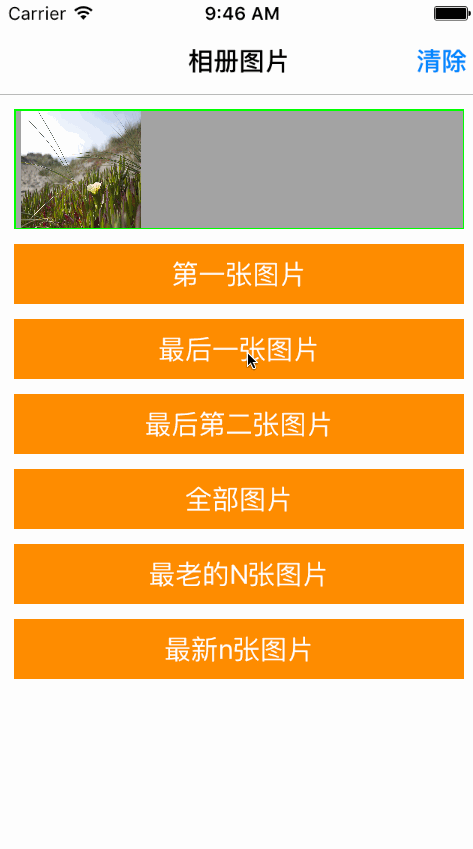

# SYLibraryPhoto
Get images from AssetsLibrary

从相册获取最新的，或最久的N张相片

导入头文件
```
#import "SYLibraryPhoto.h"
```

定义属性，并实例化
```
@property (nonatomic, strong) SYLibraryPhoto *photoHelper;

self.photoHelper = [[PhotoHelper alloc] init];
```

获取相册第一张图片，即最老的一张图片
```
[self.photoHelper GetImageFirst:^(NSArray *images) {

} error:^{
    NSLog(@"error get first image");
}];
```

获取相册最后一张图片，即最新的一张图片
```
[self.photoHelper GetImagelast:^(NSArray *images) {

} error:^{
    NSLog(@"error get last image");
}];
```

获取相册倒数第二张图片
```
[self.photoHelper GetImagelastSec:^(NSArray *images) {

} error:^{
    NSLog(@"error get last image");
}];
```

获取相册全部图片
```
[self.photoHelper GetImagesWithNum:0 latest:YES start:^{

} success:^(NSArray *images) {

} error:^{
    NSLog(@"error get last image");
}];
```

获取相册最老的10张图片
```
[self.photoHelper GetImagesWithNum:10 latest:NO start:^{
    
} success:^(NSArray *images) {

} error:^{
    NSLog(@"error get last image");
}];
```

获取相册最新的10张图片
```
[self.photoHelper GetImagesWithNum:10 latest:YES start:^{

} success:^(NSArray *images) {

} error:^{
    NSLog(@"error get last image");
}];
```

效果图




修改完善
* 20180802
  * 版本号：1.0.0
  * 源码修改
  
  

